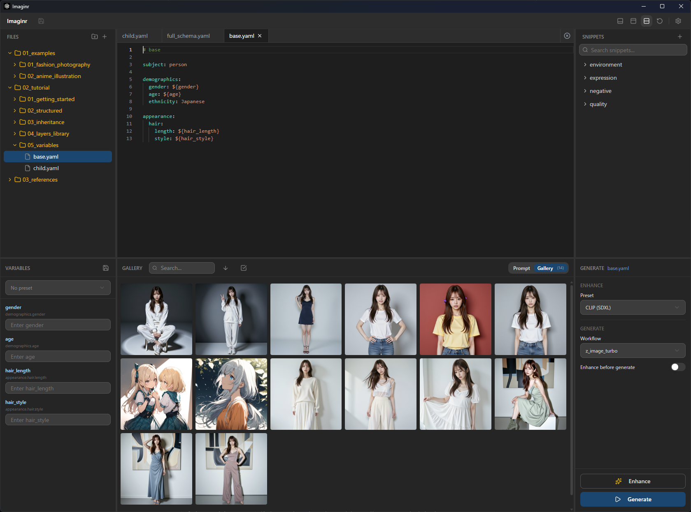

# Imaginr - YAML Prompt Builder for AI Image Generation

**画像生成AIのプロンプト、管理できていますか？**

## こんな経験ありませんか？

- プロンプトが長くなって、どこに何を書いたかわからない
- 「あのとき上手くいったプロンプト、どこいった？」
- 髪の色だけ変えたいのに、全部コピペして編集...
- 似たプロンプトが大量に散らばって収拾つかない

画像生成AIを使い込むほど、プロンプトは長く複雑になります。自然言語のまま管理し続けるのは限界があります。

## 解決策：プロンプトを構造化する

**Before（自然言語）**
```
young Japanese woman with long straight chestnut hair and brown eyes,
wearing yellow t-shirt and indigo jeans, standing, peace sign,
simple red background, professional lighting
```

どこからどこまでが服装？髪の色だけ変えたいときは？

**After（YAML構造化）**
```yaml
subject: person

demographics:
  gender: woman
  age: young
  ethnicity: Japanese

appearance:
  hair:
    length: long hair
    style: straight hair
    color: ${hair_color}  # ← 変数化して簡単に変更

outfit:
  top: t-shirt
  bottom: jeans
```

- **階層構造**で整理され、見通しが良い
- **継承・合成**で共通部分を再利用できる
- **変数**で動的に値を変えられる

## Imaginrとは

この「構造化プロンプト」を簡単に作成・管理するためのデスクトップアプリです。



### 主な機能

| 機能 | できること |
|------|-----------|
| **テンプレート継承** | `_base`で共通部分を親ファイルにまとめ、差分だけ管理 |
| **レイヤー合成** | `_layers`で服装・照明・ポーズなどのパーツを自由に組み合わせ |
| **変数システム** | `${varName}`で髪の色や背景をワンクリックで切り替え |
| **オートコンプリート** | 辞書ベースの入力補完（ソースコンテキスト表示付き） |
| **辞書管理** | アプリ内から辞書の追加・編集・削除・インポート/エクスポート |
| **複数タブ・分割** | 複数ファイルをタブで開き、左右分割で同時編集 |
| **ComfyUI連携** | ワークフロー選択 → Generate → 画像生成、ギャラリー管理 |
| **LLMエンハンサー** | Ollama連携でYAMLを自然言語プロンプトに変換 |

### どんな人向け？

- プロンプトを**体系的に管理したい**人
- 同じキャラで**バリエーション展開**したい人
- ComfyUIを使っていて、プロンプト作成を**効率化したい**人

## インストール

[Releases](https://github.com/nichiki/imaginr/releases)から最新版をダウンロード。

| OS | ファイル |
|----|----------|
| Windows | `.msi` または `.exe` |
| macOS | `.dmg` |

## クイックスタート

1. アプリを起動
2. 左ペインでサンプルテンプレートを選択
3. 中央エディタで内容を確認・編集
4. 変数があれば左下フォームで値を入力
5. ComfyUI接続済みなら「Generate」で画像生成

詳しくは [チュートリアル](docs/tutorial.md) へ。

## ドキュメント

- [チュートリアル](docs/tutorial.md) - 初めての方はこちら
- [マニュアル](docs/manual.md) - 全機能リファレンス
- [YAPS仕様書](docs/YAPS.md) - 構造化スキーマの詳細

---

## 開発者向け

### 技術スタック

| 領域 | 技術 |
|------|------|
| Desktop | Tauri 2 |
| Frontend | Next.js 16 + React 19 |
| Editor | Monaco Editor |
| Database | SQLite (tauri-plugin-sql) |
| UI | shadcn/ui + Tailwind CSS v4 |

### コマンド

```bash
npm install          # 依存関係インストール
npm run tauri:dev    # 開発モード
npm run tauri:build  # ビルド
npm run lint         # Lint
```

### ディレクトリ構成

```
src/          # Next.js フロントエンド
src-tauri/    # Tauri Rustバックエンド
data/         # バンドルリソース（templates, dictionary, snippets）
docs/         # ドキュメント
```

## ライセンス

MIT
